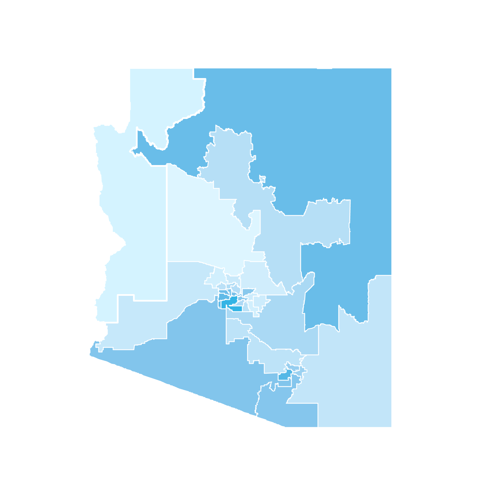

<!-- style --><link rel="stylesheet" href="style.css" type="text/css">
<link rel="shortcut icon" href="images/favicon.png">
<link rel="icon" href="images/favicon.png">
<!-- Load an icon library --><link rel="stylesheet" href="https://cdnjs.cloudflare.com/ajax/libs/font-awesome/4.7.0/css/font-awesome.min.css">
<!-- header --><div class="topnav"
style = "width: 100vw; 
  left: 50%;
  right: 50%;
  margin-left: -50vw;
  margin-right: -50vw;
  box-shadow: 0 4px 10px 0 rgba(0, 0, 0, 0.1)">
<div class="landing" style = "margin-top: -10px; padding-left: 20px; padding-right: 20px">
  <a href="index.html" style = "font-size: 28px;">Home</a>
  <a style = "float:right; font-size: 28px" href="about.html">About</a>
</div>
</div>
<!-- About Meeeeeeeeeeeeeeeeeeeeeeeeeeeeeeeeeeeee -->
<div class="wideboi" style = "margin-top:100px; background:#f0f0f0">
<div class="wrapper">
<div class="side">

<h2 align = "center" style = "font-weight: 100; font-size: 30px; margin-top: 40px;"> Joseph Broad </h2>
<h3 align = "center" style = "margin-top: 40px;"> Political Scientist<br>University of California, Davis<br><br>
<a href="mailto:jbroad@ucdavis.edu"><i class="fa fa-lg fa-envelope"></i></a>
<a href="https://github.com/jbroad"><i class="fa fa-lg fa-github"></i></a>
<a href="https://twitter.com/therealjoebroad"><i class="fa fa-lg fa-twitter"></i></a>
<a href="https://www.linkedin.com/in/joseph-broad-557071a9/"><i class="fa fa-lg fa-linkedin"></i></a></h3>
</div>
<div class="middle" style = "padding-bottom: 40px;">
<h2>About</h2>
<p><font size = "4"><br>
I am a Political Science PhD candidate at the [University of California, Davis](https://ps.ucdavis.edu/), specializing in American Politics. My substantive research interests include public opinion, political communication, and elections, as well as inferential and causal methodology (ideal point estimation, machine learning).<br><br>
  
  I have training in multiple statistical software programs to conduct my research, including R, Stata and Python. Additionally, I have a background in studying political theory with an emphasis on the Ancient Greek thinkers (Plato, Aristotle) as well as  Enlightenment and Modern Liberal thinkers (Kant, Rawls).<br><br>
  
  My full CV is available [here](https://www.dropbox.com/s/63eurd7ux7sdqh4/jbroadcv0619.pdf?dl=0).
  </font>
  </p>
  </div>
</div>
</div>
<!-- Teachiiiiiiiiiiiiiiiiiiiiiiiiiiiing -->
<div class="wideboi" style = "background:#ffffff;">
<div class="wrapper">
<div class="column">
<h2>Teaching</h2>
``` {r setup, include=FALSE}
library(ggplot2)
load(file = "cdat.Rda")
stimlabs <- c("Clarifies Difficult Material",
                "Responsive to Student Requests",
                "Displays Command of Material",
                "Overall TA Effectiveness",
                "Respects Divergent Perspectives",
                "Well-Prepared for Section",
                "Encourages Participation",
                "Clearly Defines Expectations",
                "Helps Students Appreciate Topics",
                "Provides Helpful Assignment Feedback")
cat <- qplot(x = reorder(scale, avgs),
        y    =  avgs,
        data =  cdat,
        color = "green",
        ymin = 1,
        ymax = 5) +
    geom_errorbar(aes(ymin = avgs - 2*se,
                      ymax = avgs + 2*se),
                      width = 0,
                      size = .8) +
    geom_point(aes(x=scale, y=avgs), size=2, stroke = 1.2, shape=21, fill="white") +
    scale_color_manual(values=c('#006D00')) +
    labs(title = "", x = "", y = "Avg. Response (95% CI)") +
    theme_light() +
    theme(legend.position = "none",
          text = element_text(size=12,  family="Helvetica"),
          title = element_text(size=12, family="Helvetica"),
          axis.title = element_text(size=12, family="Helvetica")) +
    scale_x_discrete(labels= rev(stimlabs)) +
    coord_flip()
```
<p><font size = "4"><br>
I love teaching, and I believe the passion I bring to the front of the classroom is reflected in students' evaluations of my performance at the end of each quarter. Figure 1 below shows students' average perceptions of my performance as a Teaching Assistant in response to multiple stimuli. The grand mean of my overall effectiveness score (4.37) has been consistently higher than the department average (4.07).</p>
``` {r echo=F, fig.align='center', fig.width = 8, fig.asp = .42, fig.fullwidth=TRUE}
cat
```
<p><font size = "4"><br>
  Below is a list of courses for which I have served as a Teaching Assistant. Those marked in
  <span style="font-weight: bold; color: #006D00;"> bold </span>
  indicate courses I am able and prepared to lead as an instructor.<br></p>
  ***
  <p align = "center"><span style="font-weight: bold; color: #006D00;">Introduction to American Politics<br>
  The Scientific Study of Politics<br>
  Introduction to Political Theory</span><br>
  Local and State Politics<br>
  California Politics<br>
  Media and Politics<br>
  Policy and Agenda-Setting<br>
  Ethnic Conflict
  </p>
</div>
</div>
</div>
<!-- Data VizzzZZZzzZZZZzzzZZZZzzzzZzzzZZzzZzZzZzzz -->
<div class="wideboi" style = "background:#f0f0f0;">
<div class="wrapper">
<h2 style = "padding-bottom: 20px;">Data Visualization</h2>
</div>
<div class="wrapper" style = "padding-top:0;">
<div class="column middle" style = "padding: 10px 0;">
<p>To supplement my formal methodological training, I have devoted much of my (limited) free time in graduate school to developing programming skills in creating visually attractive and interactive graphics. On the right is an interactive map illustrating the results of the 2018 election in Arizona's state legislature, as well as registration numbers prior to the election.</p>
</div>
<div class="column side" style="padding: 5px 0;">
<a href="https://josephbroad.shinyapps.io/shiny/">
</a>
</div>
</div>
<div class="wrapper" style = "padding-bottom: 40px;">
<div class="column middle" style = "padding:4px 0;">
<p>The skills I have developed in creating interactive graphics and applications have proved a useful means toward the end of educating my students. I have created simple applications in order to help my students learn complex statistical concepts, such as Central Limit Theorem, Standard Deviation, Standard Error of the Mean, and others (right). Additional examples forthcoming.</p>
</div>
<div class="column side" style = "padding: 5px 0;">
<a href="https://josephbroad.shinyapps.io/stats/">
</a>
</div>
</div>
</div>
<div class = "footer">
<h3>
<a href="mailto:jbroad@ucdavis.edu"><i class="fa fa-lg fa-envelope"></i></a>
<a href="https://github.com/jbroad"><i class="fa fa-lg fa-github"></i></a>
<a href="https://twitter.com/therealjoebroad"><i class="fa fa-lg fa-twitter"></i></a>
<a href="https://www.linkedin.com/in/joseph-broad-557071a9/"><i class="fa fa-lg fa-linkedin"></i></a></h3>
</div>


