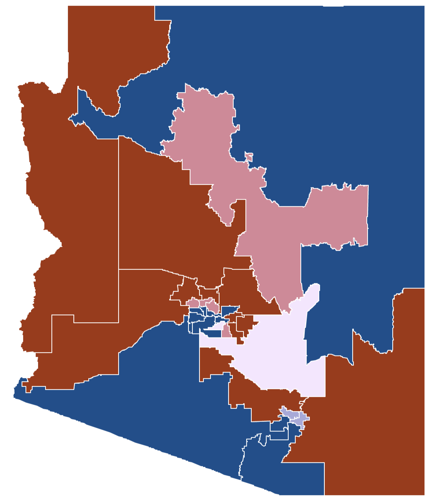

<!-- 

 -->
<!-- 
   -->
<!-- 
 -->
<!-- 
 -->
<!-- 

 -->
<!-- 
 -->
<!-- 

 -->
<!-- 
 -->
<!-- 
 -->
<!-- 

 -->

<a href="blog_001_azele2020.html"><h3>Elections 2020: Arizona State Legislature</h3></a>
<p3>Here I take a brief look into the state legislature 2018 elections, and an even briefer look into the 2020 elections. Democrats in Arizona have not been this close to gaining a majority in the state senate since 2000, when they tied with Republicans and split control. If Arizona Democrats organize in 2020 as well as they did in 2016, they will have a small chance to gain a majority in that body for the first time in more than 40 years.</p3>

<a href="blog_000_lupia25.html"><h3>Cutting Corners?</h3></a>
<p3>Here I celebrate the 25th anniversary of Arthur Lupia's 1994 seminal article, Shorctus Versus Encyclopedias, by revisiting its central themes. Using the author's original data, I identify and explore two complications in the validity of his "knowledge" variable. These complications have major implications on how we interpret Lupia's findings.</p3>

<a href="blog_000_lupia25.html"><h3>More to come!</h3></a>
<p3>That is all I have for now but you can follow me on twitter for updates on new content. Plus, I occassionally share photos of my dog, Bear. He is a labradoodle, about two years old now. There he is on the right when he was just a baby. He enjoys cuddling, showing off his paws, and pretending to pee so we can go back inside already.</p3>

