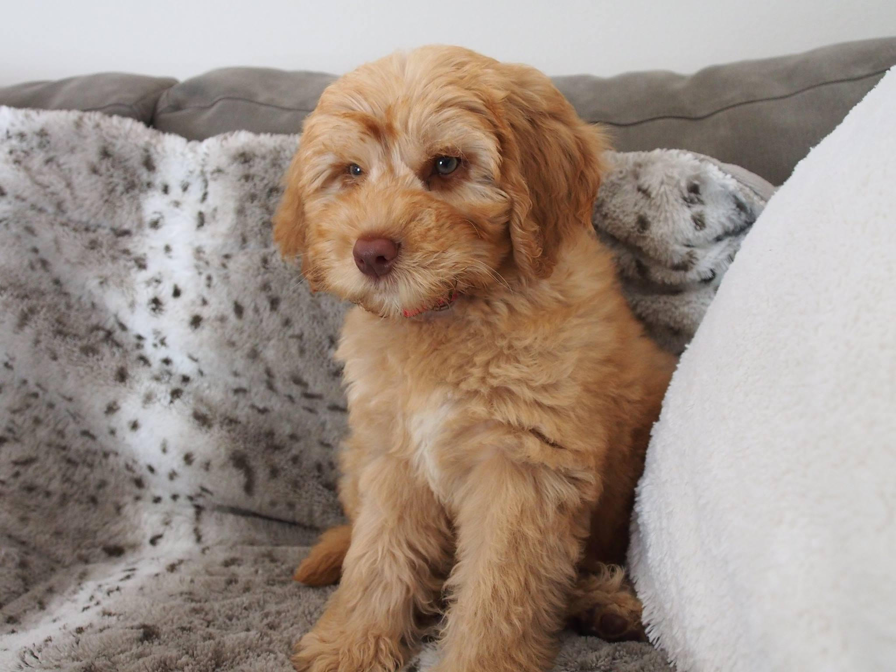

---
---

<link rel="stylesheet" href="style.css" type="text/css">

I am a Political Science PhD candidate at the [University of California, Davis](https://ps.ucdavis.edu/), specializing in American Politics. My substantive research interests include public opinion, political communication, and elections, as well as inferential and causal methodology (ideal point estimation, machine learning). 

I have training in multiple statistical software programs to conduct my research, including R, Stata and Python. Additionally, I have a background in studying political theory with an emphasis on the Ancient Greek thinkers (Plato, Aristotle) as well as Enlightenment and Modern Liberal thinkers (Kant, Rawls).

My full CV is available [here](files/jbroadcv0419).