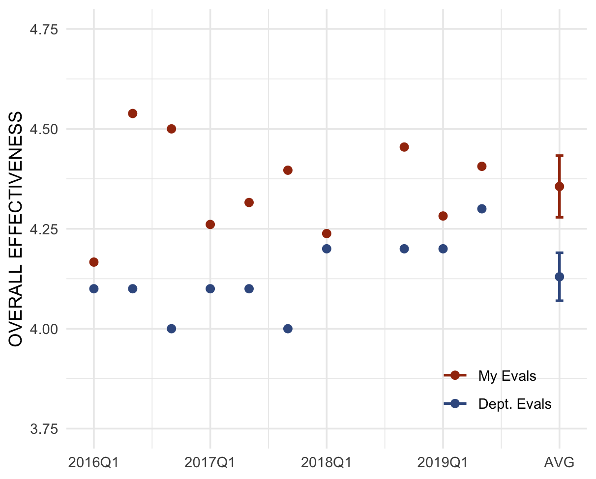

<!-- Background -->

<h3>Background</h3>
<p3>I am a PhD candidate in the UC Davis political science graduate program. My research interests include environmental politics and policy, the role and influence of interest groups in policy outcomes, rhetoric and public opinion. Prior to graduate school, I was a senior staff member for Senator Harry Reid's Washington DC office. When I'm not researching American Politics, I'm most likely reading political theory or science fiction (Frank Herbert's Dune series at the moment).</p3>

<!-- Teaching -->

<h3>Teaching</h3>
<p3>I try to bring joy and empowerment to the front end of the classroom, while maintaining rigorous and thorough learning objectives behind the curtain. Every exercise in my classroom is aimed at a higher purpose, be it the attainment of knowledge, the expansion of critical thought, or the development of crucial quotidian professional skills like reading, writing, and public speaking. Students are responsive to my approach, as my teaching evaluations are consistently positive and above the department average (one notable exception is the student who left what is undoubtedly my favorite evaluation: "This man is a BS artist").</p3>

<!-- Coding -->

<h3 style="text-align: center">Coding</h3>
<p3>Consider the Myth of Sisyphus: the existentialist philosopher Albert Camus used Sisyphus's damnation to meaningless labor as a metaphor for the absurdity and monotony of modern professions. Zeus condemned Sisyphus to shove a boulder up a hill, watch it roll down, push it back up, and so on for eternity. Coding to me is as the damnation is to Sisyphus, the difference being that if Zeus  absolved me of my punishment I would happily get right back to boulder-shoving. Through graduate school I learned the basics of R and Stata; my gluttony for punishment has led me to learn advanced statistical methods in R and Stata, webscraping in Python, web design (HTML, CSS, limited js), and <a href="file:///Users/josephbroad/Documents/GitHub/jbroad.github.io/blog_001_azele2020.html">interactive graphics with Shiny</a>.</p3>

